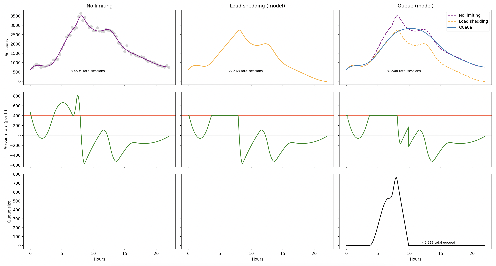

# rate-limit-model

Rate limit modeling for event registration traffic. Running `stats.py` will display plots of event registration traffic with models for load shedding and traffic limiting via queueing.

